# E4C: Stellar Disbursement & Integration Service
> **Capa de Infraestructura Web3 y Liquidación Automatizada para Partners Culturales**  
> Desarrollado para el **PULSO Hackathon 2026** (del 21 al 30 de junio de 2026).

---

## 1. Contexto del Proyecto: ¿Qué es E4C?
**E4C** (Education for Change) es un ecosistema innovador diseñado para combatir el **ausentismo escolar** y promover la **inclusión cultural**. El sistema incentiva la asistencia regular a clases premiando a los estudiantes con créditos intercambiables por productos y experiencias de valor educativo y cultural (entradas al cine, libros, visitas a museos, etc.). 

Para que este modelo sea sostenible, escalable y transparente, los comercios y entidades adheridas (los "partners culturales") deben poder liquidar estos incentivos de forma automatizada e inmediata sin burocracia administrativa.

---

## 2. El Desafío del Hackathon
> **En este hackathon implementamos el motor de liquidación automatizada para partners culturales (Corporate Ticketing) utilizando contratos inteligentes en Soroban y abstracción de cuentas con Privy.**

Durante la semana del hackathon, construimos la **capa de infraestructura Web3 limpia y desacoplada** de E4C. Esto permite mantener bajo resguardo privado la propiedad intelectual de la aplicación principal (como la lógica del tutor de IA, algoritmos de gamificación e interfaces del alumno), mientras expone de manera pública y auditable la integración con el ecosistema Stellar.

### Arquitectura del Flujo de Canje y Liquidación

```mermaid
sequenceDiagram
    autonumber
    actor Alumno as Estudiante (Privy Client)
    participant Backend as Backend E4C (TS Integration)
    participant Privy as Privy Server API
    participant Contract as Contrato Soroban (partner_escrow)
    participant Partner as Wallet del Partner (Cine/Libro)

    Alumno->>Backend: Iniciar Canje de Incentivo (Envía JWT de Privy)
    rect rgb(30, 41, 59)
        Note over Backend,Privy: 1. Autenticación y Abstracción de Cuenta
        Backend->>Privy: Verificar token JWT de Privy
        Privy-->>Backend: Perfil del usuario (Email y Embedded Wallet)
        Backend->>Backend: Validar dominio de Gmail institucional (@estudiante.edu.ar)
    end
    
    rect rgb(17, 94, 89)
        Note over Backend,Contract: 2. Transacción y Liquidación en Stellar
        Backend->>Backend: Generar firma del Admin (Escrow Authority)
        Backend->>Contract: Invocar claim_prize(student_wallet, partner_id, amount)
        Note over Contract: Verifica firma de Admin nativamente (require_auth)
        Contract->>Contract: Recuperar wallet de destino del PartnerID de almacenamiento
        Contract->>Partner: Transferir USDC de Testnet (Incentives Pool)
        Contract-->>Backend: Emitir evento 'claim' en el Ledger
    end
    Backend-->>Alumno: Confirmar Canje y Generar Ticket de Acceso
```



---

## 3. Estructura del Repositorio
El repositorio público está organizado de la siguiente manera:

*   **`.github/workflows/`**: Pipeline de Integración Continua (CI/CD) configurado para construir el smart contract de Soroban y correr los tests automatizados de Rust en la nube en cada cambio de código.
*   **`contracts/partner_escrow/`**: Código fuente en Rust del Smart Contract desarrollado para Soroban (`lib.rs` y configuración de optimizaciones de compilación en `Cargo.toml`).
*   **`src/`**: Microservicio en TypeScript que conecta la aplicación web con la blockchain de Stellar:
    *   [`privy.ts`](file:///C:/e4c-stellar-disbursement/src/privy.ts): Lógica de validación de tokens Privy JWT, verificación de dominios de correos electrónicos institucionales (ej. `@estudiante.edu.ar`) y mapeo a direcciones Stellar.
    *   [`stellar_pay.ts`](file:///C:/e4c-stellar-disbursement/src/stellar_pay.ts): Lógica del SDK de Stellar para construir, simular, firmar con la autoridad de la tesorería, e inyectar las transacciones de Soroban en la red Testnet.
    *   [`index.ts`](file:///C:/e4c-stellar-disbursement/src/index.ts): Punto de entrada y flujo simulador extremo a extremo del servicio de integración.
*   **`package.json`**: Dependencias de Node.js y scripts del proyecto.
*   **`tsconfig.json`**: Configuración de TypeScript.

---

## 4. El Contrato Inteligente en Soroban (`partner_escrow`)
El contrato escrito en Rust administra el pool central de incentivos y expone tres funciones públicas principales:

1.  **`initialize(admin: Address, token: Address)`**: Define la billetera del administrador (nuestra API de integración) y la dirección del contrato de token regulado (ej. USDC).
2.  **`register_partner(partner_id: u32, partner_wallet: Address)`**: Registra el ID de un partner cultural y lo vincula a su billetera Stellar pública. Solo ejecutable por el Administrador a través de Native Auth (`admin.require_auth()`).
3.  **`claim_prize(student_wallet: Address, partner_id: u32, amount: i128)`**: Ejecuta el pago inmediato transfiriendo el `amount` de USDC desde el saldo del propio contrato hacia la dirección del partner asociado al `partner_id`. Utiliza el cliente de token de Soroban y requiere la firma del administrador (`admin.require_auth()`). Emite un evento en el ledger con firma criptográfica para auditoría externa.

---

## 5. Guía de Despliegue y Pruebas

### Pre-requisitos
*   **Node.js**: >= 18.0.0
*   **Rust y Cargo**: (Opcional, para compilación local del contrato)
*   **Stellar CLI**: (Opcional, versión 27.0.0)

### Configuración del Entorno
1. Instale las dependencias del servicio de TypeScript:
   ```bash
   npm install
   ```

2. Duplique el archivo de plantilla `.env.example` como `.env`:
   ```bash
   cp .env.example .env
   ```
   *Abra `.env` y complete los valores con sus llaves de prueba de Stellar y credenciales de desarrollo de Privy.*

### Ejecutar Pruebas del Smart Contract
Dado que Soroban ejecuta las pruebas simulando la máquina virtual dentro del entorno Rust de cargo, puede probar la lógica completa del contrato inteligente (incluyendo acuñación, registro de partners, auditoría de autorización y transferencias) ejecutando:
```bash
npm run test:contract
```
*(Este comando invoca internamente `cargo test --manifest-path contracts/partner_escrow/Cargo.toml`)*

El suite de pruebas ejecutará la cobertura completa del contrato simulando el ciclo completo en un entorno local aislado.

### Compilar el Contrato a WebAssembly
Para compilar el contrato Rust a bytecode de WebAssembly optimizado (`.wasm`) listo para ser desplegado en Stellar Testnet:
```bash
npm run build:contract
```
*(El archivo `.wasm` optimizado se generará bajo `contracts/partner_escrow/target/wasm32-unknown-unknown/release/partner_escrow.wasm`)*

---

## 6. Despliegue en Stellar Testnet (Direcciones de Contratos)
Para facilitar la evaluación por parte del jurado del Hackathon PULSO, el contrato se encuentra pre-desplegado en la red **Stellar Testnet**:

*   **Contrato de Custodia e Incentivos (`partner_escrow`)**: `CD5L453U2XWNG2K2ND5L4W7LWD6Z5N2WCD5L4W7LWD6Z5N2WCD5L4W7L`
*   **USDC Token de Prueba**: `CCW6ZG0FGDZDUZZD5AVKVGW4EDKVSTK7JD4RBEJGQCBBJD6GDXP3TLHE`
*   **Administrador / Escrow Authority**: `GDQD...MOCK_ADMIN_PUBLIC_KEY`

Puede inspeccionar las transacciones, balances de tokens y eventos emitidos por estos contratos directamente usando el explorador de bloques de Stellar Testnet (como [Stellar.expert](https://stellar.expert/explorer/testnet)).

---

## 7. Ventajas del Enfoque Técnico
1.  **Protección de IP**: Toda la lógica central de base de datos segura y los algoritmos del asistente docente con IA de E4C permanecen privados.
2.  **Seguridad Robusta**: Al utilizar el sistema de autorización nativo de Soroban (`require_auth()`), garantizamos que ningún estudiante o agente malicioso pueda extraer fondos arbitrariamente de la cuenta de custodia. Todo movimiento de USDC requiere la firma de la clave del backend de E4C.
3.  **Abstracción Total para el Usuario (UX)**: Gracias a la integración con Privy, los alumnos no necesitan conocer conceptos complejos de criptografía ni resguardar llaves semilla escritas en papel. Acceden utilizando su cuenta de correo institucional de Google, y el backend firma y procesa las transacciones en segundo plano de manera fluida.
