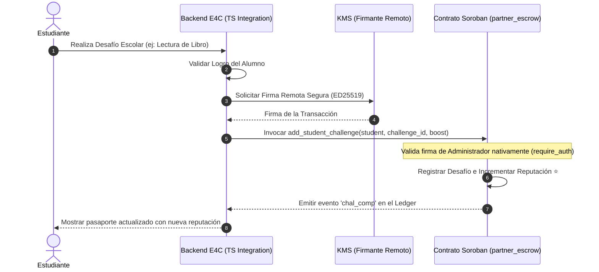
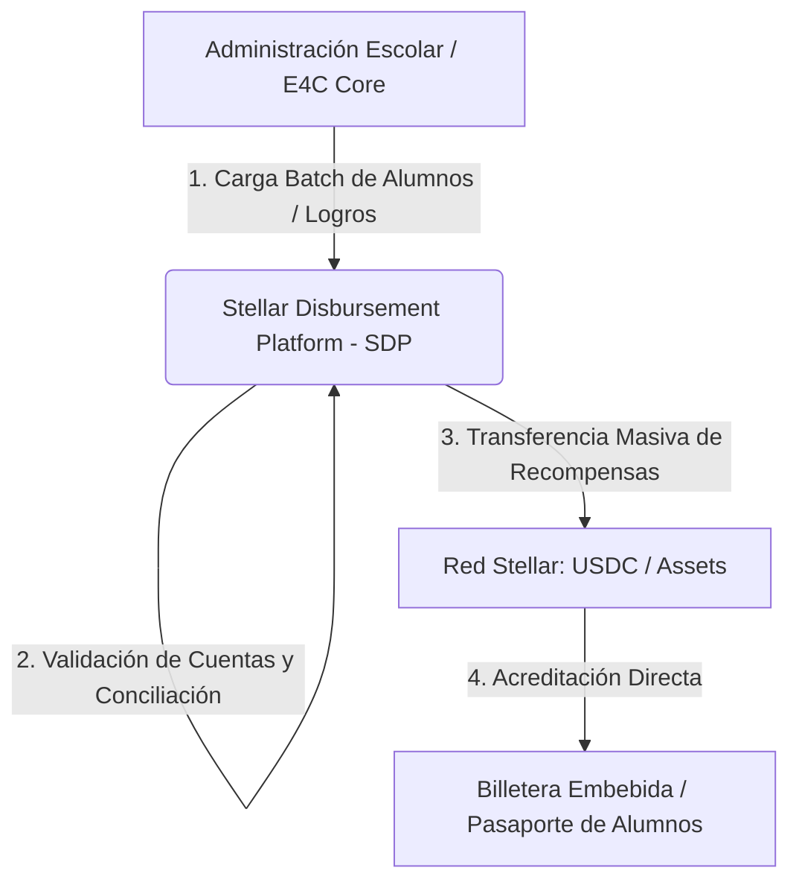

```mermaid
sequenceDiagram
    autonumber
    actor Alumno as Estudiante (Privy Client)
    participant Backend as Backend E4C (TS Integration)
    participant Privy as Privy Server API
    participant Contract as Contrato Soroban (partner_escrow)
    participant Partner as Wallet del Partner (Cine/Libro)

    Alumno->>Backend: Iniciar Canje de Incentivo (Envía JWT de Privy)
    rect rgb(30, 41, 59)
        Note over Backend,Privy: 1. Autenticación y Abstracción de Cuenta
        Backend->>Privy: Verificar token JWT de Privy
        Privy-->>Backend: Perfil del usuario (Email y Embedded Wallet)
        Backend->>Backend: Validar dominio de Gmail institucional (@estudiante.edu.ar)
    end
    
    rect rgb(17, 94, 89)
        Note over Backend,Contract: 2. Transacción y Liquidación en Stellar
        Backend->>Backend: Generar firma del Admin (Escrow Authority)
        Backend->>Contract: Invocar claim_prize(student_wallet, partner_id, amount)
        Note over Contract: Verifica firma de Admin nativamente (require_auth)
        Contract->>Contract: Recuperar wallet de destino del PartnerID de almacenamiento
        Contract->>Partner: Transferir USDC de Testnet (Incentives Pool)
        Contract-->>Backend: Emitir evento 'claim' en el Ledger
    end
    Backend-->>Alumno: Confirmar Canje y Generar Ticket de Acceso
```

# E4C: Stellar Disbursement & Integration Service
> **Capa de Infraestructura Web3, Liquidación Automatizada y Pasaporte Estudiantil**  
> Desarrollado para el **PULSO Hackathon 2026** (del 21 al 30 de junio de 2026).

---

## 1. Contexto del Proyecto: ¿Qué es E4C?
**E4C** (Education for Culture) es un ecosistema innovador diseñado para combatir el **ausentismo escolar** y promover la **inclusión cultural**. El sistema incentiva la asistencia regular a clases premiando a los estudiantes con créditos intercambiables por productos y experiencias de valor educativo y cultural (entradas al cine, libros, visitas a museos, etc.). 

Para que este modelo sea sostenible, escalable y transparente, los comercios y entidades adheridas (los "partners culturales") deben poder liquidar estos incentivos de forma automatizada. Adicionalmente, los méritos y logros del alumno son registrados en un **Pasaporte Estudiantil** on-chain, construyendo una reputación académica descentralizada.

---

## 2. Arquitectura de Integración (Stellar & Soroban)

### Flujo 1: Canje y Liquidación en USDC (Corporate Ticketing)


### Flujo 2: Pasaporte Estudiantil y Reputación Académica ⭐


---

## 3. Estructura del Repositorio
El repositorio público está organizado de la siguiente manera:

*   **`contracts/partner_escrow/`**: Código fuente en Rust del Smart Contract desarrollado para Soroban.
*   **`src/`**: Microservicio en TypeScript que conecta la aplicación web con la blockchain de Stellar:
    *   [`privy.ts`](file:///C:/e4c-stellar-disbursement/src/privy.ts): Validación de tokens Privy JWT y mapeo de correos institucionales a direcciones Stellar.
    *   [`stellar_pay.ts`](file:///C:/e4c-stellar-disbursement/src/stellar_pay.ts): Lógica del SDK de Stellar para interactuar con Soroban (incluyendo el módulo del Pasaporte Estudiantil).
    *   [`index.ts`](file:///C:/e4c-stellar-disbursement/src/index.ts): Simulador extremo a extremo que emula Privy, desafíos, pasaportes y liquidaciones.
    *   [`lib/kms.ts`](file:///C:/e4c-stellar-disbursement/src/lib/kms.ts): Cliente de firma remota (AWS/GCP KMS) para el resguardo seguro de claves.
*   **`api/` & `app/api/`**: Rutas serverless de Vercel y Next.js App Router:
    *   [`api/passport.ts`](file:///C:/e4c-stellar-disbursement/api/passport.ts): Consulta pública del pasaporte de un estudiante.
    *   [`api/challenge.ts`](file:///C:/e4c-stellar-disbursement/api/challenge.ts): Registro de desafíos completados (POST).
    *   [`api/reputation.ts`](file:///C:/e4c-stellar-disbursement/api/reputation.ts): Modificación directa de reputación por administrador (POST).
    *   [`api/claim.ts`](file:///C:/e4c-stellar-disbursement/api/claim.ts): Ejecución de liquidaciones USDC (POST).
    *   [`app/api/disbursement/route.ts`](file:///C:/e4c-stellar-disbursement/app/api/disbursement/route.ts): Endpoint de liquidación con Next.js, asincronía de timeouts de Vercel y firma delegada vía KMS.

---

## 4. Funciones del Contrato Inteligente Soroban (`partner_escrow`)
El contrato escrito en Rust expone las siguientes funciones públicas principales:

### Gestión de Custodia y Partners:
1.  **`initialize(admin: Address, token: Address)`**: Define la billetera del administrador y la dirección del contrato de token (ej. USDC).
2.  **`register_partner(partner_id: u32, partner_wallet: Address)`**: Registra el ID de un partner cultural (Cine/Biblioteca) y lo vincula a su billetera. Solo ejecutable por el Admin (`admin.require_auth()`).
3.  **`claim_prize(student_wallet: Address, partner_id: u32, amount: i128)`**: Transfiere USDC desde el pool de custodia del contrato hacia la dirección del partner asociado al `partner_id`. Requiere la firma del admin (`admin.require_auth()`).

### Pasaporte Estudiantil y Reputación (Novedad):
4.  **`get_student_passport(student: Address) -> Option<StudentPassport>`**: Recupera los desafíos superados y el score de reputación actual del alumno.
5.  **`add_student_challenge(student: Address, challenge_id: u32, reputation_boost: u32)`**: Registra un desafío superado (evitando duplicados) y suma puntos de reputación al alumno. Solo ejecutable por el Admin (`admin.require_auth()`).
6.  **`update_student_reputation(student: Address, reputation: u32)`**: Permite ajustar o fijar directamente la reputación del alumno en la blockchain. Solo ejecutable por el Admin (`admin.require_auth()`).

---

## 5. Seguridad OWASP Top 10 Implementada
Para garantizar la robustez en producción, los endpoints serverless implementan:
*   **Defensa contra Inyecciones (OWASP A03)**: Validación estricta de variables de entrada. El monedero (`studentWallet`) es comprobado con la expresión regular `/^G[A-Z2-7]{55}$/`, y el monto se valida como numérico estrictamente positivo.
*   **Control de Acceso y Autenticación (OWASP A01/A07)**: Solicitudes críticas de escritura protegidas con el encabezado `Authorization: Bearer <API_SECRET_TOKEN>`.
*   **Evitar Exposición de Información (OWASP A05)**: Exclusiones de stack traces o errores XDR de Soroban expuestos al usuario. El sistema responde con mensajes genéricos en caso de error.
*   **Sanitización de Logs (OWASP A09)**: Sanitización de cualquier entrada de usuario en `console.log/warn/error` eliminando saltos de línea (`\r\n`) para evitar log forgery.

---

## 6. Integración con Stellar Disbursement Platform (SDP)
Para escalar la distribución masiva de recompensas (USDC) a nivel escolar y regional, **E4C** se integra con la **[Stellar Disbursement Platform (SDP)](https://stellar.org/products-and-tools/disbursement-platform)**, la herramienta oficial de la SDF para desembolsos digitales masivos.

### Arquitectura de Distribución de Incentivos con SDP:


### Funciones Clave de la Integración con SDP:
1.  **Distribución Masiva Programada**: Automatiza el desembolso mensual de USDC a miles de alumnos de manera simultánea en base a su nivel de reputación acumulado on-chain.
2.  **Dashboard de Auditoría Escolar**: Ofrece a los colegios y entidades gubernamentales un panel web unificado para monitorear presupuestos de incentivos escolares, exportar reportes de conciliación y verificar entregas conformes.
3.  **Enrolamiento Dinámico de Recipientes**: Vincula las cuentas de correo institucional del alumno y su billetera Stellar embebida (mapeada vía Privy) en la base de datos de beneficiarios del SDP de forma automática.

---

## 7. Guía de Ejecución y Pruebas

### Pre-requisitos
*   **Node.js**: >= 18.0.0
*   **Rust / Cargo**: (Solo para pruebas locales de contrato inteligente - requiere enlazador C++ MSVC)

### Configuración del Entorno
1. Instale dependencias:
   ```bash
   npm install
   ```
2. Configure su archivo `.env` tomando como base `.env.example`:
   ```bash
   # Configura tus variables locales y de Vercel
   API_SECRET_TOKEN=tu-token-seguro-api
   ADMIN_PUBLIC_KEY=GDQD...
   ADMIN_SECRET_KEY=SBCXP... # Requerido para firmar en simulador local
   ESCROW_CONTRACT_ID=CD5L453U2XWNG2K2ND5L4W7LWD6Z5N2WCD5L4W7LWD6Z5N2WCD5L4W7L
   ```

### Simulación Completa en Consola
Puedes correr el flujo de simulación completo en TypeScript (que emula Privy, la creación de pasaportes, la asignación de desafíos de reputación y el reclamo final en Soroban) ejecutando:
```bash
npm run build
npm start
```
